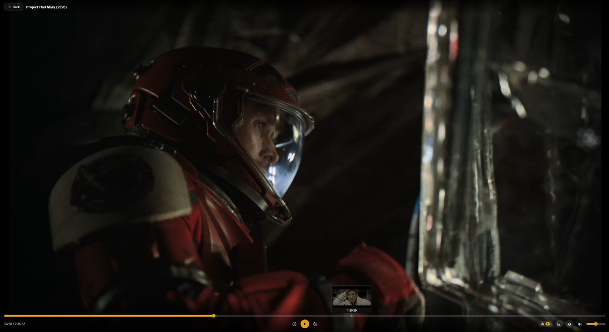
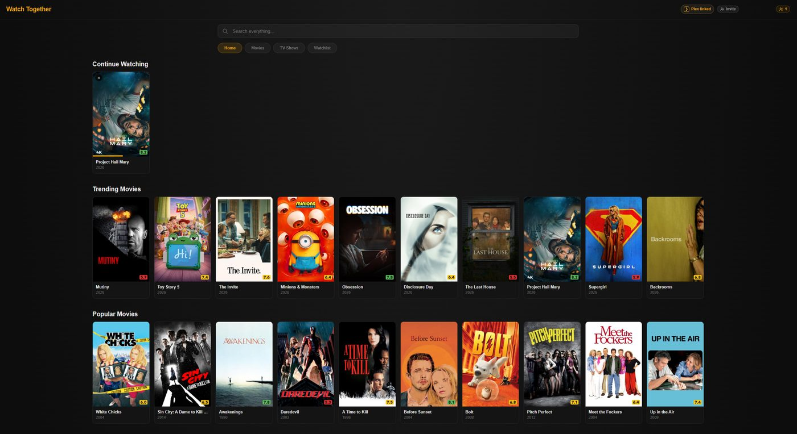
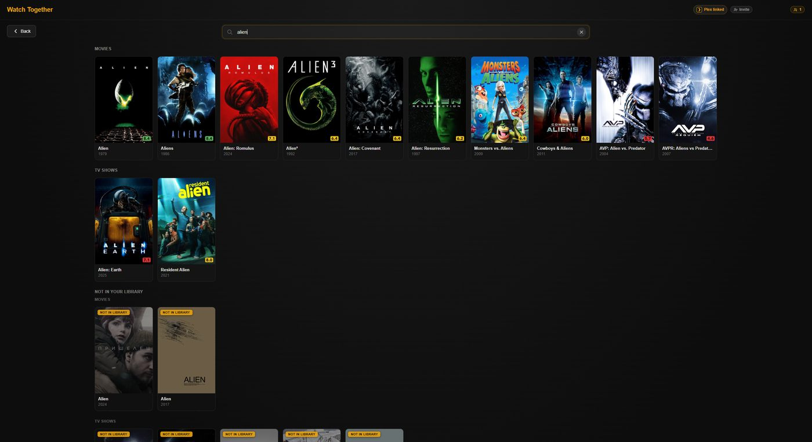
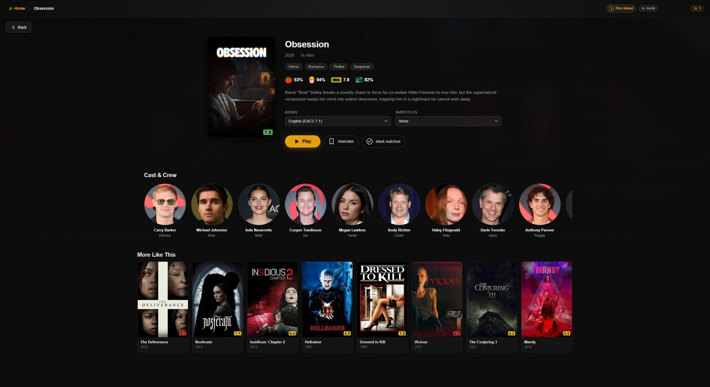
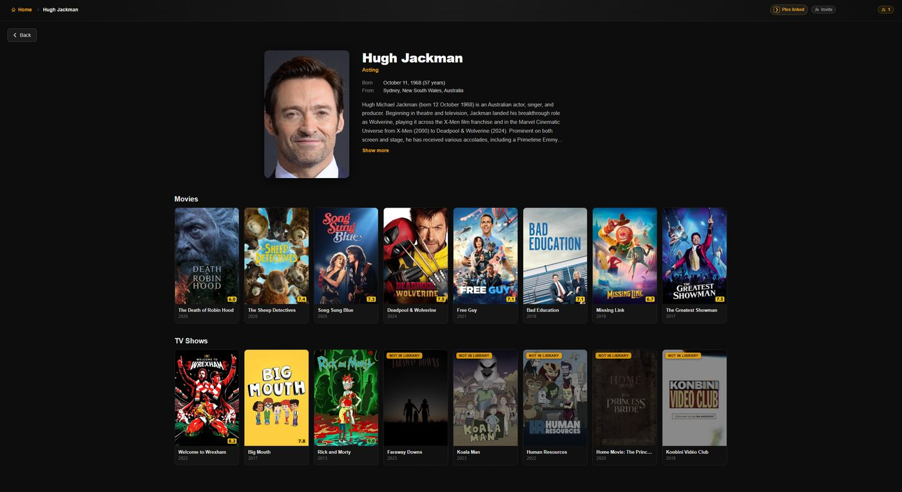
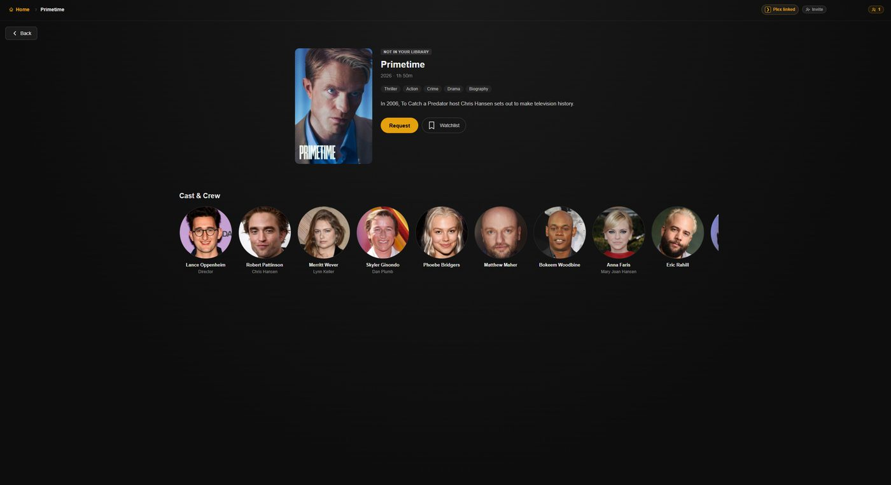
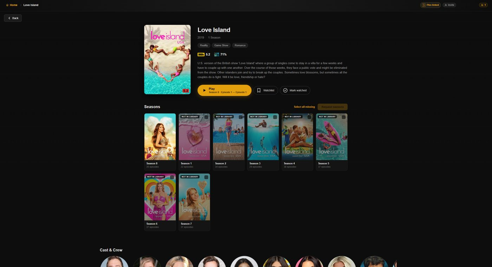
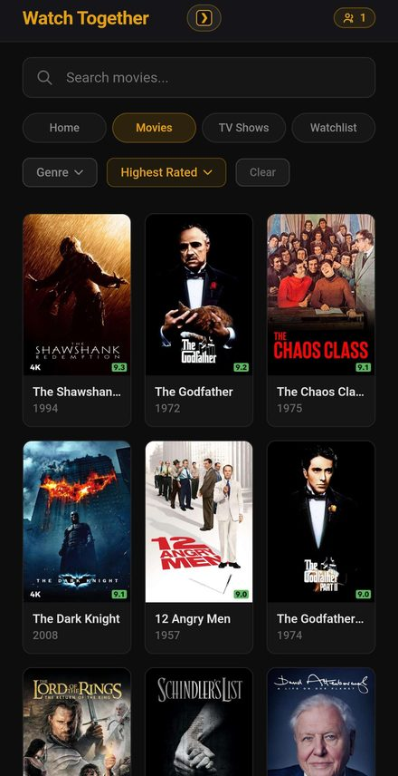
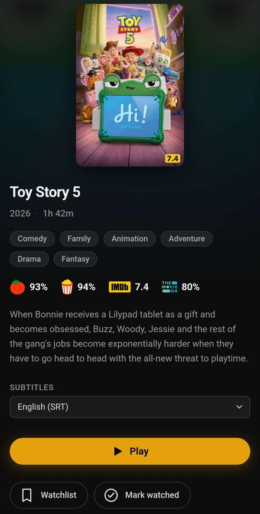

# Plex Discord Theater

Watch your Plex library with friends, inside a Discord voice channel. Everyone
sees the same thing at the same time — one person drives, everyone else follows.

> [!WARNING]
> **This project is vibe coded.**
>
> Nearly all of it was written by an AI assistant working from prompts, rather
> than typed out and reviewed line by line by a person. It does run real watch
> parties, and the awkward parts — playback sync, transcode teardown, host
> handover — have been debugged against production logs rather than guessed at.
> There is no test suite in CI, no external security review, and no human has
> read every line.
>
> Treat it accordingly: great for watching films with friends on a server you
> control, not something to put in front of the open internet or trust with
> anything you would miss.

---

## What it looks like

The Activity runs right inside the voice channel. Everyone in the room is on the
same frame, and hovering the seek bar gives you Plex's thumbnail previews.



Back out of the player and you land on your Plex home screen — the same hubs your
server already builds.



Search covers your library and Plex Discover together, so titles you haven't got
yet still turn up — badged **Not in library** so you can tell them apart.



Every title gets a detail page: ratings, synopsis, cast, and the audio and
subtitle tracks to pick before you hit Play.



Click anyone in **Cast & Crew** for their filmography — everything of theirs in
your library, matched on Plex's own tags.



With Seerr connected, you can request anything you don't have
without leaving the Activity.



Shows request by season, and only the seasons Sonarr could actually fill — so
nothing sits in Seerr forever waiting on episodes that haven't aired.



Mobile gets its own layout rather than a shrunk-down desktop one

|  |  |
| :-- | :-- |
| **On mobile** — browsing. | **On mobile** — a detail page |

---

## What you get

Everyone in the voice channel opens the Activity and lands in the same room.
The host picks something; it starts for everybody at once. Pause, seek, change
the subtitles — the room follows.

- **Synchronised playback.** Small drifts are pulled back by nudging playback
  speed a fraction instead of seeking, so keeping the room together doesn't cost
  everyone a buffer every few minutes.
- **Co-hosts and host handover.** Hand out playback control, or the host role
  itself, from the people panel. Roles belong to the person, not the connection,
  so a dropped WiFi signal doesn't silently demote anyone. If the host leaves, a
  co-host takes over and the film keeps going.
- **Browse and search your whole library** — filters, sorting, Cast & Crew
  pages. Search takes in Plex Discover too, so titles you don't own show up
  badged **Not in library**, with a Request button if you run Overseerr or
  Jellyseerr.
- **See what's missing from a season.** A toggle on the season page reveals the
  episodes you don't have, keeping *missing* (aired, never downloaded) apart from
  *unaired*, with air dates.
- **Audio and subtitle tracks**, switchable mid-episode. Your subtitle choice
  carries to the next episode, matched by language rather than track number.
- **Play Version.** When a title has more than one version in Plex, pick which
  one plays. The 4K version is hidden whenever there's a 1080p or lower one
  alongside it — everything is transcoded to 1080p anyway, so streaming the 4K
  file gains the room nothing and costs your server a 4K decode for every
  viewer. A title that only exists in 4K still plays.
- **Skip Intro and Skip Credits**, thumbnail previews on the seek bar, up-next
  cards, a shared queue, and viewer suggestions.
- **Stats for nerds** — press `i` during playback for resolution, codecs,
  bitrate, buffer health and peer counters.
- **A proper mobile layout**, not a shrunk-down desktop one. Three posters per
  row, detail pages that stack, play/pause in the middle of the picture, and
  double-tap either side to skip 10 seconds. Discord's mobile bar already has an
  invite button, so this doesn't stack a second one on top of it.

> [!NOTE]
> Skip Intro/Credits and thumbnail previews both rely on data **Plex** has to
> generate first, and neither says anything when it's missing. Turn on *Detect
> intros and credits* and *Generate video preview thumbnails* under Library →
> Edit → Advanced. Both are off by default on many servers.

---

## Getting started

You'll need: a Plex server, Docker, a Discord application, and a public HTTPS
URL (Discord loads the Activity in an iframe, so it can't be localhost).

### 1. Create the Discord application

1. Go to [discord.com/developers/applications](https://discord.com/developers/applications)
   and create an application.
2. Under **Activities → Settings**, enable Activities.
3. Add a URL mapping: `/` → your public URL.
4. Copy the **Client ID** and **Client Secret** — you'll need both.

### 2. Get your Plex token

Open Plex Web, play anything, and find `X-Plex-Token=` in the browser's Network
tab. The [official guide](https://support.plex.tv/articles/204059436-finding-an-authentication-token-x-plex-token/)
has screenshots.

### 3. Configure

```bash
cp .env.example .env
```

Fill in these six, and you're running:

```env
DISCORD_CLIENT_ID=your_discord_client_id
DISCORD_CLIENT_SECRET=your_discord_client_secret
PLEX_URL=http://localhost:32400
PLEX_TOKEN=your_plex_token
REDIRECT_URI=https://your-public-url.example.com
ALLOWED_ORIGINS=https://your-public-url.example.com
```

Everything else in `.env.example` is optional, and each one simply turns its
feature off when unset. See [Optional extras](#optional-extras) — `TMDB_API_KEY`
is the one worth adding first.

### 4. Run it

```bash
docker compose up -d --build
```

Check it came up, and see which extras are live:

```bash
docker compose logs | grep Config
```

### 5. Launch

Join a voice channel, click the **Activities** (rocket) icon, and pick your app.

<details>
<summary><b>Running locally instead of Docker</b></summary>

```bash
npm install
npm run dev        # server on :3000, client on :5173
```

You'll also need `packages/client/.env`:

```env
VITE_DISCORD_CLIENT_ID=your_discord_client_id
```

Discord still needs a public HTTPS URL, so tunnel it:

```bash
cloudflared tunnel --url http://localhost:5173
```

Set the resulting URL as your Discord URL mapping. It changes every restart —
use a [named tunnel](https://developers.cloudflare.com/cloudflare-one/connections/connect-networks/get-started/create-local-tunnel/)
if that gets annoying.
</details>

---

## Optional extras

Every one of these is off unless you set its variable, and every one **fails
quietly** — the row or button just doesn't appear, which is easy to mistake for
a bug. The server prints which are live at startup:

```
[Config] ✓ TMDB   ✓ TVDB   ✓ Ratings   ✓ Requests   ✓ Discover   · VPS relay (P2P mode)   · Guild allowlist (open to any Discord server)
```

`✓` is on. `·` is off, with the consequence in brackets.

| Variable | What it adds | Where to get it |
|---|---|---|
| `TMDB_API_KEY` | Collections, "More Like This", cast/crew pages | Free — [themoviedb.org](https://www.themoviedb.org/settings/api) |
| `TVDB_API_KEY` | Accurate season numbering for the missing-episode list | Free — [thetvdb.com](https://thetvdb.com/api-information) |
| `MDBLIST_API_KEY` | IMDb, Rotten Tomatoes and TMDB scores | Free — [mdblist.com](https://mdblist.com/preferences) → API Access |
| `PLEX_ACCOUNT_TOKEN` | Detail pages for titles you don't own; signs in to Seerr as you | Your **account** token (not the server one) from an app.plex.tv request |
| `SEERR_URL` | Request button on titles you don't have | Your Overseerr / Jellyseerr URL |
| `VPS_RELAY_URL` + `VPS_RELAY_KEY` | [Relay](#vps-relay) — one upstream stream instead of one per viewer | Your own VPS |
| `ALLOWED_GUILD_IDS` | Restricts the activity to named Discord servers | Comma-separated guild IDs. Unset = any server |

### TMDB — collections, related titles, people

Adds three things to detail pages: **"Also in this collection"** (the whole
franchise, with anything you don't own marked and requestable), **"More Like
This"**, and **cast and crew pages** listing everything a person appears in.

Without a key the collection row still appears but lists only what you already
own — so a partial series looks complete. Worth setting for that reason alone.

### TVDB — which episodes a season actually has

The missing-episode list needs to know what a season *should* contain. TMDB can
tell it, and usually does fine — but Sonarr works from **TVDB**, and the two
sometimes disagree about which season an episode belongs to. When they differ, a
TMDB-derived list names episodes that really sit in a neighbouring season, and
requesting them achieves nothing.

With a key set, TVDB is used whenever the show has a TVDB id. Either way the
list is checked against your own episode numbers first — if a source can't
account for the episodes you already have, it's describing a different season,
so it's dropped rather than shown.

A free *project* key needs no PIN. A user-supported subscriber key does — put it
in `TVDB_PIN`.

### MDBList — ratings

IMDb, Rotten Tomatoes (critic **and** audience) and TMDB scores on detail pages.
Rotten Tomatoes has no public API, so the scores come via
[MDBList](https://mdblist.com), a free aggregator.

### Seerr — requesting titles

Set `SEERR_URL` and a Request button appears on titles you don't own. Requests
are made as **your own Seerr account**: the server signs in with
`PLEX_ACCOUNT_TOKEN`, so there's no admin API key to configure. Films request in
one click; TV offers per-season selection showing what you have, what's pending,
and what's available.

---

## How it works

```
Discord voice channel
  └─ Activity (iframe)
       └─ React client (hls.js)
            ├─ VPS relay (nginx cache) — when configured
            ├─ OR: WebRTC ↔ other viewers (P2P segment sharing) — fallback
            └─ Express backend (WebSocket sync + API proxy + segment pre-fetch)
                 └─ Plex Media Server (HLS transcoding)
```

The first person to join becomes the host. Everyone else follows over a
WebSocket. The backend proxies every Plex API call and every video segment, so
**your Plex token never reaches a browser**. Sessions, host roles, watch history
and artwork live in SQLite and survive restarts.

### Getting video to everyone

This is all about one problem: your home upload. Plex transcodes once, but by
default every viewer pulls that stream from your connection.

**A VPS relay is the answer beyond a few viewers.** With `VPS_RELAY_URL` set,
your server uploads one stream and the VPS fans it out:

```
Without:  home upload = viewers × bitrate
With:     home upload = 1 stream (~8-12 Mbps), whatever the viewer count
```

**Segment pre-fetching** runs either way. Plex throttles delivery for roughly the
first 30 seconds of a transcode — exactly when someone is staring at a spinner —
so the server polls ahead, pulls segments with three workers and serves them from
memory. Memory is capped at 384 MB in total, shared across up to four concurrent
sessions.

**P2P sharing** is the fallback with no VPS: viewers form a WebRTC mesh and
share segments with each other, falling back to the server when a peer can't
supply one in time.

> [!NOTE]
> P2P carries less than you'd expect — in one two-viewer session it moved 17 MB
> against 3,994 MB over HTTP. The loader prefers HTTP for anything inside the
> buffer window, which is most of it. **For more than a couple of viewers, use
> the VPS relay.**

### Transcode settings

| Setting | Value | Why |
|---|---|---|
| Video codec | H.264 | Plays everywhere |
| Audio | AAC preferred, MP3 fallback | Compatible audio passes through; TrueHD and similar are re-encoded |
| Max resolution | 1920×1080 | Good quality without silly bandwidth |
| Target bitrate | 12 Mbps (peak 20) | Tune with `VIDEO_BITRATE_KBPS` / `VIDEO_PEAK_BITRATE_KBPS` |
| Segment length | 3 seconds | Faster cold start — Plex only transcodes 3s before the first segment is ready |
| Location | LAN | Avoids Plex's WAN throttling |

Video is always re-encoded rather than direct-streamed. Direct streaming hands
the browser the source's raw stream including any keyframe or timestamp
discontinuity in the file — which the browser cannot play across, wedging
playback mid-episode with no recovery.

---

## VPS relay

Routes video segments through a VPS (~$7/mo) so your home connection uploads one
stream instead of one per viewer. At 10 viewers and 8 Mbps that's the difference
between 80 Mb/s and ~8 Mb/s.

1. **Create a VPS** — e.g. Hetzner CAX11/CX23, Ubuntu 24.04, primary IPv4.
2. **Install nginx + certbot** and set up SSL for `theater.yourdomain.com`.
3. **Add a Discord URL mapping** — `/theater` → `theater.yourdomain.com`.
4. **Whitelist the VPS IP in Cloudflare** (an IP Access Rule, not a WAF Skip
   rule) if your domain sits behind it.
5. **Point nginx at Express**, *not* directly at `Plex:32400` — Plex throttles
   external delivery to 1× realtime and playback stutters.
6. **Set both variables** (`VPS_RELAY_KEY` via `openssl rand -hex 32`):
   ```env
   VPS_RELAY_URL=https://theater.yourdomain.com
   VPS_RELAY_KEY=your-secret-key
   ```

Full nginx config and step-by-step instructions:
**[docs/vps-relay-setup.md](docs/vps-relay-setup.md)**

With both set, segment URLs are rewritten to `/theater/seg/...`, nginx checks the
key and proxies to Express, Express serves from its pre-fetch cache or fetches
from Plex locally, and the VPS caches the result for five minutes. P2P turns
itself off. Remove either variable and everything reverts.

---

## Troubleshooting

| Problem | What it means |
|---|---|
| "Failed to connect to Discord" | Launch it as an Activity from a voice channel, not by visiting the URL directly |
| Library is empty | Check `PLEX_URL` / `PLEX_TOKEN`, and that the container can reach Plex |
| Video won't play | Check the browser console for HLS errors; confirm Plex can transcode |
| "Session expired" | The server restarted — close and reopen the Activity |
| "Reconnecting…" | The sync socket dropped and is retrying. Your own playback keeps going; the room just can't see you until it's back. Clears itself, or offers a Reconnect button once the automatic attempts run out |
| "Unknown instance" on join | The activity registration expired after 24h idle. Close and reopen the Activity |
| Tunnel URL changed | Update the URL mapping in the Discord Developer Portal |
| Audio is MP3, not AAC | Expected for TrueHD/DTS sources. MP3 plays fine everywhere |
| No skip intro / previews | Plex hasn't generated them — see the note under [What you get](#what-you-get) |
| No ratings | `MDBLIST_API_KEY` isn't set |
| No collections or "More Like This" | `TMDB_API_KEY` isn't set. A collection row showing only titles you own means the same thing |
| Missing episodes look wrong | Set `TVDB_API_KEY` — Sonarr numbers seasons by TVDB, and TMDB sometimes disagrees |
| Not sure what's enabled | `docker compose logs \| grep Config` |
| VPS segments 403 | Key mismatch between `.env` and the nginx config — or Cloudflare blocking the VPS, which needs an IP Access Rule |
| VPS segments 502 | The VPS can't reach Express — check that Cloudflare rule and your domain's DNS |
| VPS stutters | nginx is proxying straight to `Plex:32400`; it must go through Express |
| Segments blocked in Discord | Missing `/theater` URL mapping in the Developer Portal |

---

## Built with

| Layer | Technology |
|---|---|
| Client | React, hls.js, [p2p-media-loader](https://github.com/novage/p2p-media-loader), Discord Embedded App SDK |
| Server | Express, WebSocket (ws), bittorrent-tracker, better-sqlite3 |
| Streaming | HLS via the Plex transcoder, server-side segment pre-fetch, WebRTC P2P sharing |
| Infrastructure | Docker, Node.js 24, optional nginx VPS relay |

## License

[GPL-3.0](LICENSE)
